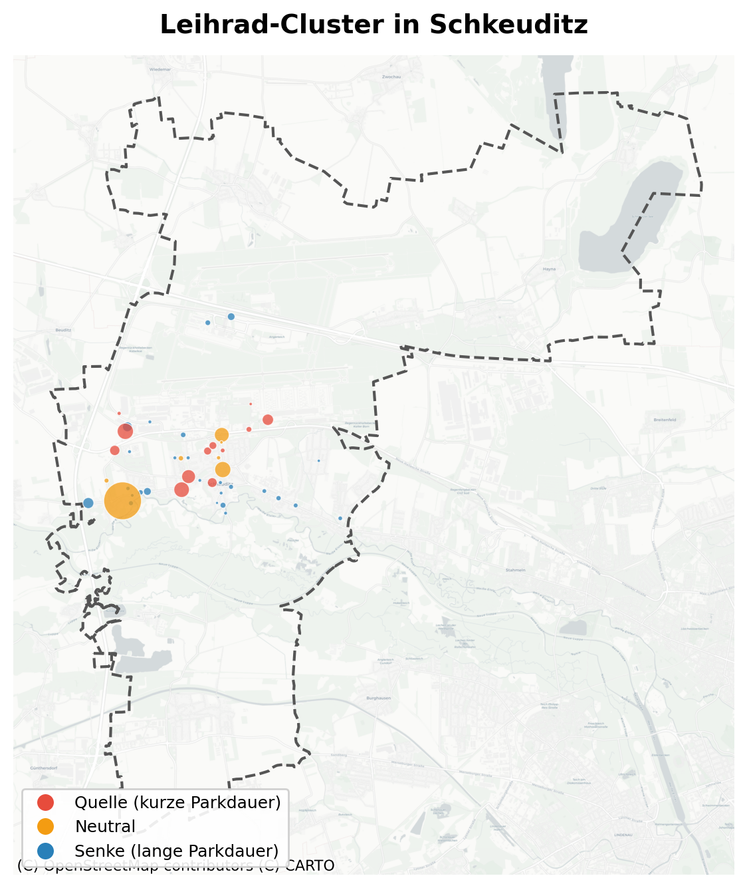

# Embracer Action

Datengestützte Umverteilung von Leihrädern in Schkeuditz — ein Forschungsprojekt
der TU Bergakademie Freiberg.

## Repositories

- **[Collection-and-Prediction](https://github.com/IfI-EmbracerAction/Collection-and-Prediction)** —
  Datenerhebung, DBSCAN-Clustering, Bedarfsprognose und Routenoptimierung
- **[Presentation](https://github.com/IfI-EmbracerAction/Presentation)** —
  Quarto-Präsentation der Ergebnisse
